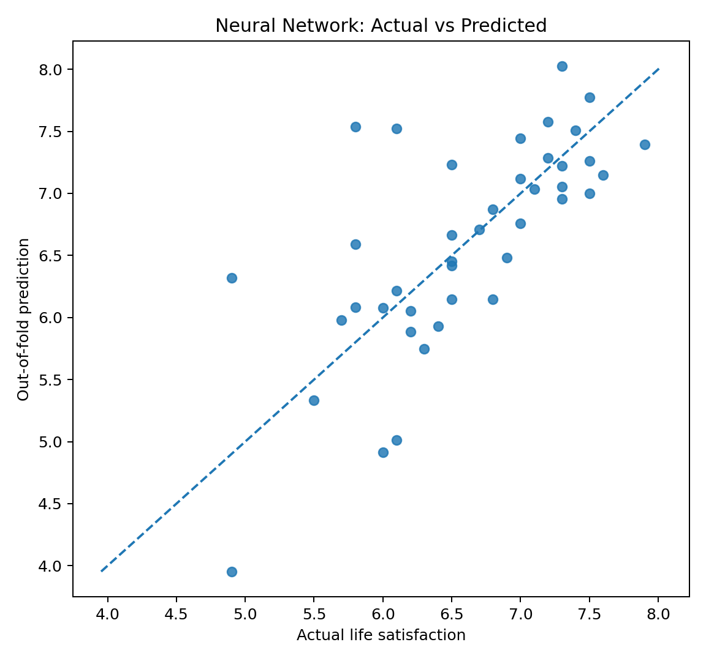

# OECD Life Satisfaction Prediction

A portfolio-ready machine-learning project that predicts country-level **life satisfaction** from OECD Better Life Index indicators.

The project started as a neural-network notebook and was refactored into a reproducible scikit-learn workflow with leakage-safe preprocessing, cross-validation, baseline models, saved predictions, tests, and diagnostic plots.

## Highlights

- Historical OECD Better Life Index (`DF_BLI`) data
- Target: `SW_LIFS` — **Life satisfaction**
- Country-level regression
- Leakage-safe imputation, scaling, and feature selection inside `Pipeline`
- 10-fold shuffled cross-validation
- Ridge, Random Forest, and Multi-Layer Perceptron (MLP) comparison
- Reproducible result files and plots
- Automated tests with GitHub Actions

## Recorded benchmark from the original notebook

The uploaded source notebook contains a completed run on **41 countries** with **23 candidate indicators**. Its recorded 10-fold neural-network benchmark is:

| Metric | Value |
|---|---:|
| RMSE | **0.6068** |
| MAE | **0.4449** |
| R² | **0.2825** |
| Pearson r | **0.7067** |
| Pearson r² | **0.4995** |
| Predictions within ±0.5 | **70.73%** |



> **Important:** these numbers are preserved from the original notebook for traceability. The refactored implementation moves mean imputation *inside* cross-validation, fixing a small leakage issue in the original notebook. Therefore, a fresh run of the refactored pipeline may produce slightly different metrics.

## Selected indicators in the original notebook

The original completed run selected these 10 indicators using `SelectKBest(f_regression)`:

| Code | Indicator |
|---|---|
| `EQ_AIRP` | Air pollution |
| `EQ_WATER` | Water quality |
| `HO_BASE` | Dwellings without basic facilities |
| `HO_NUMR` | Rooms per person |
| `HS_LEB` | Life expectancy |
| `IW_HADI` | Household net adjusted disposable income |
| `JE_EMPL` | Employment rate |
| `JE_PEARN` | Personal earnings |
| `PS_FSAFEN` | Feeling safe walking alone at night |
| `SC_SNTWS` | Quality of support network |

## Data provenance

The project uses the OECD Better Life Index historical dataflow `DF_BLI`. The OECD now maintains a newer Well-being Data Monitor / Better Life Index, while the historical dataflow remains available through the OECD Data Explorer archive.

For reproducibility, `src/download_data.py` defaults to a frozen public mirror of the historical OECD CSV that matches the target values and country coverage used by the original notebook. The raw dataset is **not committed** to this repository; the downloader records how to obtain it instead.

Download the historical snapshot:

```bash
python src/download_data.py
```

Or request the OECD archive endpoint directly:

```bash
python src/download_data.py --source oecd
```

## Methodology

The long-format OECD data is filtered to the total-population observations and pivoted into a country × indicator matrix. Repeated country/indicator observations, if present, are averaged.

Each model is evaluated with shuffled K-Fold cross-validation using a fixed random seed. Preprocessing is fitted **inside each training fold**:

1. `SimpleImputer(strategy="mean")`
2. `MinMaxScaler()`
3. `SelectKBest(f_regression)`
4. Regression estimator

Models included:

- Ridge Regression
- Random Forest Regressor
- Multi-Layer Perceptron (`MLPRegressor`)

## Why the refactor matters

The original notebook performed `fillna(X.mean())` before cross-validation. That lets validation-fold values influence the imputation mean. The refactored code puts imputation inside the scikit-learn pipeline, so every preprocessing step is learned only from the training portion of each fold.

## Repository structure

```text
oecd-life-satisfaction-ml/
├── .github/
│   └── workflows/
│       └── tests.yml
├── data/
│   └── README.md
├── notebooks/
│   └── oecd_life_satisfaction_walkthrough.ipynb
├── results/
│   ├── original_notebook_metrics.csv
│   ├── original_notebook_cv_predictions.csv
│   ├── original_notebook_selected_features.csv
│   ├── original_notebook_actual_vs_predicted.png
│   └── original_notebook_residuals.png
├── src/
│   ├── download_data.py
│   └── train.py
├── tests/
│   └── test_pipeline.py
├── .gitignore
├── LICENSE
├── README.md
└── requirements.txt
```

## Setup

```bash
python -m venv .venv
```

macOS/Linux:

```bash
source .venv/bin/activate
```

Windows PowerShell:

```powershell
.venv\Scripts\Activate.ps1
```

Install dependencies:

```bash
pip install -r requirements.txt
```

## Reproduce the experiment

```bash
python src/download_data.py
python src/train.py --data data/oecd_bli.csv
```

The refactored run writes:

```text
results/model_comparison.csv
results/cv_predictions.csv
results/selected_features.csv
results/model_comparison.png
results/actual_vs_predicted.png
results/residuals.png
```

Optional configuration:

```bash
python src/train.py \
  --data data/oecd_bli.csv \
  --folds 10 \
  --k-features 10 \
  --tolerance 0.5
```

## Evaluation metrics

- RMSE
- MAE
- R²
- Pearson correlation (`r`)
- Pearson `r²`
- Percentage of predictions within an absolute error tolerance (default ±0.5)

The ±0.5 value is a regression tolerance metric, **not classification accuracy**.

## Limitations

- The sample size is small at the country level, so neural-network results should be interpreted alongside simpler baselines.
- `SelectKBest` is univariate and does not model feature interactions during selection.
- Historical `DF_BLI` values are a snapshot; the OECD has since updated its well-being framework and Better Life Index.
- The original recorded benchmark predates the leakage-safe imputation refactor and is kept only for traceability.

## Possible extensions

- Repeated or nested cross-validation
- Hyperparameter tuning with nested CV
- Permutation importance / SHAP-style explainability for the strongest model
- Explicit time-aware modeling if multiple time periods are introduced
- Uncertainty intervals for country-level predictions

## License

Code in this repository is released under the MIT License. OECD/source data is not covered by the code license; refer to the source provider's terms.
